# Codex Pets by jahhweh

## Pets

| Pet | Preview |
| --- | --- |
| Alien Rasta |  |
| Anxious Cloud |  |
| Blue Space Traveler | 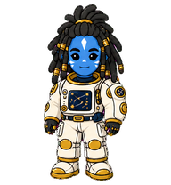 |
| Al Capone |  |
| Chibi Jahhweh |  |
| Chrome Crab | 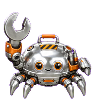 |
| Cosmic Rasta Gecko | 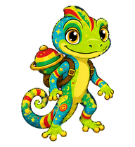 |
| Culvert Oracle Axolotl | 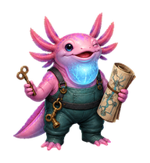 |
| Jahhweh IRL |  |
| Leafy |  |
| Lee Scratch Perry |  |
| Mailbox Goblin |  |
| Mushroom Wizard |  |
| Neon Muse |  |
| Night-Shift Firefly Inspector |  |
| Pepe Clown |  |
| Pirate Jahhweh |  |
| Pirate Parrot | 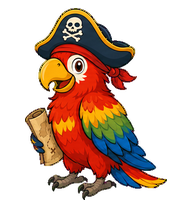 |
| Pocket Volcano |  |
| Puddle Warrant Possum |  |
| Rambo | 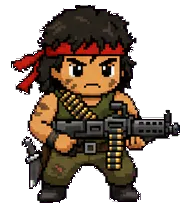 |
| Ras Robo Lion | 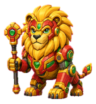 |
| Rasta Dragonfly | 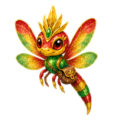 |
| Ruby |  |
| Shredder |  |
| Skateboard Skeleton |  |
| Skatey |  |
| Sewing Machine Stitcher | 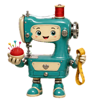 |
| Trenchcoat Crow | 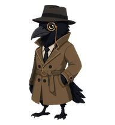 |
| V3R4 | 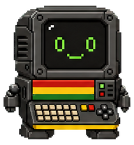 |
| Vibes Monitor |  |
| Vending Machine Oracle |  |

## How To Install

drag-and-drop folders into your `.codex/pets`.

## How To Use

in codex app, go to settings --> pets
click refresh
select your pet
click wake/show pet
